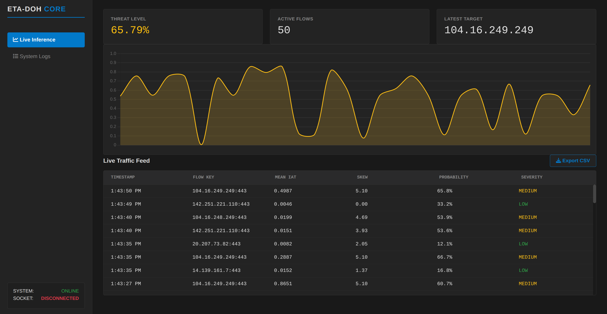

# ETA-DoH: Encrypted Traffic Analysis

This work is a functional prototype designed for real-time detection of command-and-control (C2) beacons hidden within DNS-over-HTTPS (DoH) tunnels. The core objective was to move beyond packet-size analysis, which is limited by RFC 8484 padding, and instead focus on temporal side-channels. By analyzing the  automated traffic versus the stochastic nature of human browsing, the system identifies malicious beacons.

## Architecture and Distributed Setup
The project is implemented across a three-node distributed environment to simulate a real-world network deployment. A dedicated Gateway/Router node acts as the sensor agent, sniffing live traffic and exporting flow metadata to a central linux-based core analyzer. This analyzer manages the heavy lifting through a multiprocessing pipeline that handles asynchronous ingestion, statistical feature extraction, and ML inference simultaneously. The final node is a GUI-based victim machine used to generate both benign background traffic and simulated C2 beaconing via automated shell scripts.

## Methodology and Dataset
The detection engine employs a Random Forest classifier trained on the CIC-DoHBrw-2020 Dataset((https://www.unb.ca/cic/datasets/dohbrw-2020.html), developed by the Canadian Institute for Cybersecurity. Feature extraction is centered on Inter-Arrival Time (IAT) statistics—specifically the mean, variance, and skewness—to characterize the deterministic “heartbeat” patterns commonly observed in botnet command-and-control communications.

## Output

## Status and Future Work
This project is currently a work in progress and serves as a proof-of-concept for side-channel DoH monitoring. While the ingestion and inference pipelines are functional, the system requires further refinement in its feature set to better handle false positives. Future updates will focus to enhance the model's accuracy against real C2 traffic.
